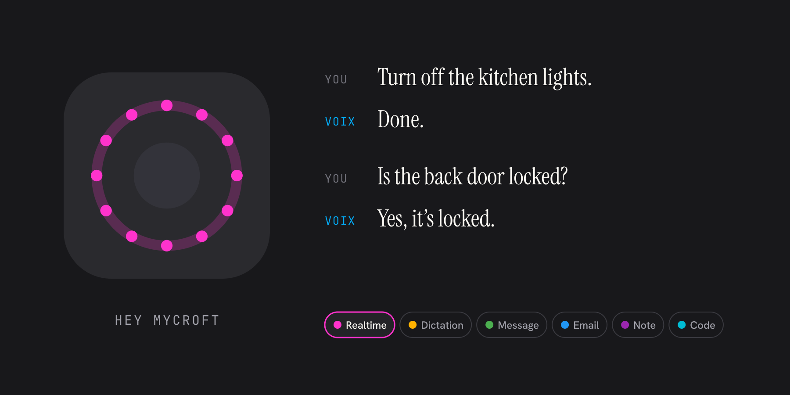
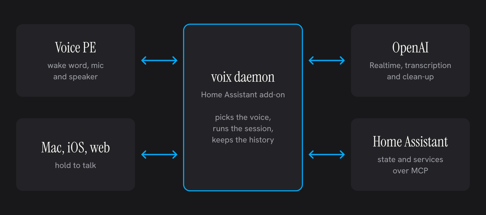

<p align="center">
  
</p>

<h1 align="center">Voix</h1>

<p align="center">Real-time conversation and dictation for the Home Assistant Voice PE, run from your own network.</p>

> [!NOTE]
> Voix is dormant. No work has gone into it since 1 June 2026, and it is not maintained.
> This README describes it as it was left. [Status](#status) lists what was never tested on real hardware.



## Getting started

Voix has three parts: a daemon that runs each voice session, a Home Assistant integration that tells your Voice PE where the daemon is, and firmware for the Voice PE. You need an OpenAI API key, [Bun](https://bun.sh) 1.3 and [ESPHome](https://esphome.io) 2026.5 or later.

1. **Install the integration.** Copy `ha-integration/custom_components/voix` to `/config/custom_components/voix` on your Home Assistant, then restart Home Assistant. Go to **Settings → Devices & services → Add integration** and choose **voix**.
2. **Copy the token.** The integration makes a shared token and shows it as `sensor.voix_ws_token`, on the **voix gateway** device. The daemon and the Voice PE must both use it.
3. **Start the daemon** on a computer on the same network:

   ```sh
   git clone https://github.com/RainnWorks/voix && cd voix
   bun install
   bun run build:ui
   cd voix-backend
   cp .env.example .env
   ```

   In `.env`, set `OPENAI_API_KEY`, and set `VOIX_WS_TOKEN` to the token from step 2. For Home Assistant tools, add `HA_URL` (for example `http://homeassistant.local:8123`) and `HA_TOKEN` (a long-lived access token), and turn on Home Assistant's **Model Context Protocol Server** integration. Then run `bun run start`. The daemon listens on port 8765.
4. **Point the integration at the daemon.** Open the voix integration, click **Configure**, choose **Defaults**, and set the daemon URL to `ws://<daemon-host>:8765/ws`.
5. **Flash the Voice PE.** Copy `esphome/home-assistant-voice-095e4e.yaml`, change `esphome: name:` to your device's name, and put your Wi-Fi details and API encryption key in `esphome/secrets.yaml`. Then:

   ```sh
   esphome run esphome/<your-device>.yaml
   ```

6. **Adopt it.** Add the Voice PE in Home Assistant's ESPHome integration and turn on **Allow the device to perform Home Assistant actions** in its options. The voix integration then sends the Voice PE the daemon's address and the token.
7. **Say "Hey Mycroft"** and ask something. The answer plays through the Voice PE.

The code also packages the daemon as a Home Assistant add-on, through `repository.yaml`, but its images were never published. See [Limits](#limits).

## Use

### Wake words

The Voice PE listens for two wake words:

| Wake word | Default | What happens |
|---|---|---|
| Voix | Hey Mycroft | Starts a voix session with the current voice |
| Assist | Okay Nabu | Runs Home Assistant's own Assist, untouched |

Change either one on the Voice PE's device page in Home Assistant, with **voix wake word** and **voix assist wake word**. The choices are Okay Nabu, Hey Jarvis, Hey Mycroft and Stop.

### Voices

A voice is a name, a colour, the models to use, and the prompts. Press the centre button on the Voice PE to move to the next voice. The LED ring turns that voice's colour.

| Voice | Kind | What it does |
|---|---|---|
| Realtime | Conversation | Talks back through the Voice PE, and can control Home Assistant |
| Dictation | Dictation | Writes down exactly what you said |
| Message | Dictation | Tidies it up as a casual chat message |
| Email | Dictation | Formats it as a professional email |
| Note | Dictation | Formats it as structured notes in Markdown |
| Code | Dictation | Turns it into a prompt for an AI coding assistant |

A conversation ends when the model decides it is over, after 5 seconds of silence, or after 3 minutes. Every session is kept in the history, with its transcript and a recording.

### Apps

The daemon serves a web app at `http://<daemon-host>:8765/`. It has four screens: **Voices**, to edit and add voices; **Conversations**, the history; **Surfaces**, the connected devices; and **Settings**.

The same app was built for macOS and iOS. Each one asks for the daemon's address the first time it opens.

- **Mac:** hold ⌃⌥Space, speak, and let go. Voix pastes the text into the app in front. Without the Accessibility permission, it copies the text to the clipboard instead. Voix also has a menu bar item.
- **iPhone:** hold the talk button and speak. A voix keyboard is also included. It opens the app to record, because iOS keyboards cannot use the microphone, and then puts the text back where you were typing.

### Daemon settings

Set these in `voix-backend/.env`:

| Setting | Default | What it is for |
|---|---|---|
| `OPENAI_API_KEY` | none, required | Conversations, transcription and clean-up |
| `VOIX_WS_TOKEN` | none, required | The shared token every Voice PE and app must send |
| `HA_URL` | `http://supervisor/core`, which works only inside the add-on | Where to reach Home Assistant |
| `HA_TOKEN` | not set | A Home Assistant access token. Without it, sessions have no Home Assistant tools |
| `OPENROUTER_API_KEY` | not set | Voices that clean up text with an OpenRouter model |
| `DEEPGRAM_API_KEY` | not set | Voices that use Deepgram for transcription |
| `VOIX_PORT` | 8765 | The port for the apps and the Voice PE |
| `VOIX_LOG_LEVEL` | info | trace, debug, info, warn or error |

## How it works



The Voice PE hears the wake word itself. Voix's firmware then stops Home Assistant's Assist and opens a WebSocket straight to the daemon. It sends the token and the current voice, then streams the microphone as 16 kHz audio.

The daemon looks up the voice. For a conversation it opens an OpenAI Realtime session, with Home Assistant's tools from its MCP server, and streams the model's speech back to the Voice PE. For dictation it transcribes the audio, then, if the voice has a clean-up prompt, passes the text through a language model. It saves the transcript and a recording either way.

Home Assistant itself carries no audio. The integration finds each Voice PE that runs voix firmware and sends it the daemon's address and the token. It also keeps the current voice, the wake words and the LED ring colour in step.

## Limits

- **The add-on cannot be installed.** Adding this repository in Home Assistant lists the **voix backend** add-on, but its images were never published, so the install fails. Run the daemon yourself, as in Getting started.
- **You need an OpenAI account.** Conversations only work through OpenAI Realtime, and every built-in voice uses OpenAI to transcribe.
- **The daemon has no login.** Anyone who can reach port 8765 can open the web app, read the token and change your voices. Keep it on a network you trust.
- **Voice PE only.** The firmware is written for the Voice PE's microphones, speaker, LED ring and button.
- **One conversation lasts 3 minutes at most.**
- **Dictation from the Voice PE is not typed anywhere.** It goes to the history. Only the Mac app pastes.

## Status

As it was left on 1 June 2026:

- Most of the code has run only against stubs and recorded audio. The Voice PE firmware with the current voice handling was compiled but never flashed.
- The Mac and iPhone apps were run in development builds and the simulator. Hold-to-talk on iPhone was never tested end to end. The keyboard was never tried on a real iPhone, which needs an Apple Developer account.
- The Mac app still has the standard **File** menu, with items that do nothing.
- The integration still uses the old word "mode" for voices in its services and entities.

## Build from source

You need [Bun](https://bun.sh) 1.3. The integration tests need Python, and the apps need Xcode and CocoaPods.

```sh
bun install

# Daemon on http://localhost:8765
cd voix-backend
bun run dev

# Checks, as CI runs them
bun run check                       # from the repo root
bun test && bun run typecheck       # in voix-backend
bun run build                       # in voix-backend/ui

# Integration tests
pip install -r ha-integration/tests/requirements-test.txt
cd ha-integration && pytest

# Firmware
esphome compile esphome/<your-device>.yaml

# Mac and iPhone apps
cd clients/app
bundle install
(cd ios && bundle exec pod install)
(cd macos && bundle exec pod install)
bun run start                       # Metro, in its own terminal
bun run macos                       # or: bunx react-native run-ios
```

Where things live:

| Path | What |
|---|---|
| `voix-backend` | The daemon, and the add-on's `config.yaml` and Dockerfile |
| `voix-backend/ui` | The web app build |
| `packages/ui` | The screens shared by the web, Mac and iPhone apps |
| `packages/protocol` | Message types shared by the daemon and the apps |
| `clients/app` | The Mac and iPhone apps, and the iPhone keyboard |
| `ha-integration` | The Home Assistant integration and its tests |
| `esphome` | The Voice PE firmware package and the `voix_realtime_client` component |
| `docs/STATE.md` | Where the project stood when it was left |

Things that may surprise you:

- The daemon serves the web app from `voix-backend/ui/dist`, so run `bun run build:ui` before you open it.
- `bun run dev` in `voix-backend` watches the source and restarts on each change.
- The firmware package uses the component from the local `esphome/components` folder, so compile from a checkout of this repository.
- The Mac app runs from the bundle made at build time and does not reload when the JavaScript changes.
- The apps start with a development daemon address. Change `DEFAULT_DAEMON_URL` in `packages/ui/src/platform/appInfo.native.ts`, or enter yours when the app first opens.

## License

No licence has been chosen.
